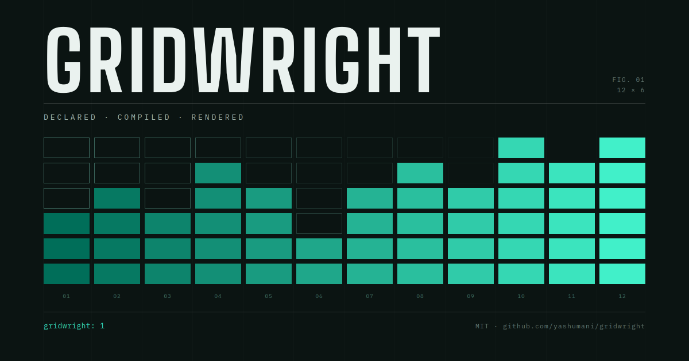

# Gridwright

**A schema-driven dashboard engine.** Write a manifest, get a working React
dashboard — cross-filtering, joins and all — without writing a component.

[](https://github.com/yashumani/gridwright/actions/workflows/ci.yml)
[](LICENSE)

## Start with a CSV, not a manifest

Open the playground and drop a spreadsheet on it. Gridwright reads the columns,
works out which ones group and which ones add up, and builds a dashboard you can
click through — then shows you the manifest it wrote, which you can edit, save
and reopen. No account, no install, and nothing is uploaded: every byte is read
and every query runs inside the tab.

```bash
pnpm install && pnpm build
pnpm --filter @gridwright/playground dev     # then drag a .csv onto the page
```

Guesses are conservative and stated rather than hidden. A column that identifies
a row is not summed; a column with a distinct value per row is not turned into a
chart of one bar each; a bare year is not read as a date. Anything it got wrong
is one edit away in **Build**.

## Or write the manifest yourself

```yaml
gridwright: 1
title: Sales overview

source:
  kind: file
  files: [{ id: sales, path: ./sales.csv }]

model:
  fields:
    - { name: region, type: string, from: sales.region }
    - { name: amount, type: number, from: sales.amount }
  dimensions:
    - { id: region, field: region, label: Region }
  measures:
    - { id: revenue, label: Revenue, expr: "sum(amount)", format: "$#,##0" }
    - { id: orders,  label: Orders,  expr: "count()" }
    - { id: aov,     label: Avg order, expr: "measure(revenue) / measure(orders)" }

datasets:
  by_region:
    dimensions: [region]
    measures: [revenue, orders, aov]
    sort: [{ measure: revenue, dir: desc }]

panels:
  - { id: tbl, type: table, dataset: by_region,
      layout: { x: 0, y: 0, w: 12, h: 6 },
      props: { columns: [{ ref: region }, { ref: revenue }, { ref: aov }] } }
```

That is a dashboard. Drop it and its CSV into the playground together and it is
running.

## Why

Dashboards are configuration, not code. Every BI platform has proven it: a
chart's whole definition — dimensions, measures, formatting, click behaviour —
is a data structure, and the config UI is generated from a schema rather than
hand-written.

Gridwright is that model on an engine you own. No licence dependency, no server
to install, and a manifest that is portable anywhere.

## What makes it work

**Measures compose.** `measure(revenue) / measure(orders)` defines arithmetic
once and reuses it. Expressions are a small typed language — parsed to an AST,
compiled to SQL or evaluated in a sandbox. No `eval`, no `Function`, and no
member-access node in the grammar, so an expression has no route to a host
object. → [Expressions](docs/expressions.md)

**Panels ship a schema for their own props.** The renderer validates manifests
against it and the builder generates its editing form from it, so a new panel
type extends the manifest language without touching the core and nobody
hand-writes a config UI. → [Panels](docs/panels.md)

**Cardinality is the join correctness mechanism.** Fact→dimension many-to-one
keeps the grain, so `sum()` still means what it says. Following that edge
backwards multiplies rows and inflates every aggregate downstream, silently —
so the planner traverses only in the safe direction and refuses anything else by
name. Joins are LEFT, never INNER: a fact with a missing dimension row surfaces
under a null group rather than vanishing from the totals. → [Joins](docs/joins.md)

**The whole manifest is editable visually**, not just the panels — fields,
dimensions, measures, datasets and relations, with expressions validating as you
type. Panels drag and resize on the grid rather than being positioned by typing
four numbers. Export keeps the comments of the file it was opened from, so an
engineer's YAML and an analyst's edits can share one file.
→ [Architecture](docs/architecture.md#the-builder)

**Your colours, checked rather than trusted.** Give it one brand hex and it
builds a whole palette at the spacing that keeps series apart; paste a set and
anything that would vanish into the background, read as grey, or be
indistinguishable from its neighbour under colour blindness is named in words,
with a one-click fix in the same hue. Nothing is refused — you just find out
before you publish. → [Panels](docs/panels.md#colour)

**Files stream into columns.** A 350 MB CSV never exists as one JavaScript
string. Measured: 5M rows group in 1.8 s and cross-filter in 0.2 s. The honest
ceiling is a few million rows in a browser tab, and the numbers are in the docs
rather than implied. → [Data sources](docs/data-sources.md#measured-scale)

## Documentation

| | |
|---|---|
| [Getting started](docs/getting-started.md) | Your first dashboard, then embedding one. |
| [The manifest](docs/manifest.md) | Every key, with its type, default and limit. |
| [Expressions](docs/expressions.md) | The two tiers and the function catalogue. |
| [Joins](docs/joins.md) | Relations, cardinality, and what is refused. |
| [Panels](docs/panels.md) | What ships, the colour rules, and adding your own. |
| [Data sources](docs/data-sources.md) | Formats, measured scale, and pushdown adapters. |
| [Architecture](docs/architecture.md) | How a query runs and what each package owns. |

## Install

> **Not on npm yet.** The packages are prepared for publishing and the names are
> unclaimed, so the command below does not work today. Use the repository
> directly until a release is cut — this note comes first because the caveat
> under a copy-pasteable command is a caveat nobody reads.

```bash
git clone https://github.com/yashumani/gridwright.git
cd gridwright && pnpm install && pnpm build
```

Once published:

```bash
pnpm add @gridwright/react @gridwright/engine @gridwright/panels
pnpm add -D gridwright        # the CLI
```

```tsx
import { loadBundle } from "@gridwright/engine";
import { Dashboard, injectStyles } from "@gridwright/react";

injectStyles();
const r = loadBundle(manifestText, [{ name: "sales.csv", text: csv }]);
if (r.ok) return <Dashboard manifest={r.manifest} source={r.source} />;
```

## Status

**Pre-1.0, and honest about it.** 524 tests, three worked examples, and a
[changelog](CHANGELOG.md) that says what you can rely on. What is deliberately
not here:

- **The associative model.** Cross-filtering works; Qlik's grey "excluded
  values" behaviour does not. That needs an inverted index across the whole
  model maintained incrementally — a research spike, not a checkbox.
- **A pushdown adapter.** The `DataSource` seam is real and the SQL emitter is
  tested, but `MemorySource` is still the only implementation.
- **Many-to-many joins, self-joins, one-to-many traversal.** Refused by name
  rather than approximated.
- **Scale far past a few million rows in-browser.** See the measured table.
- **Numbers wearing their formatting.** `$1,234.50`, `12.5%` and `(500)` are
  read as text, not as 1234.5, 0.125 and -500. Stripping the decoration is easy;
  agreeing what a percent column *means* is not, and guessing wrong silently is
  worse than leaving it to you.
- **Non-ASCII column headers.** A column named `région` is skipped, by name, in
  the note the importer shows you — the identifier grammar the manifest format
  holds `field.from` to is ASCII.

**It has never met a real dataset.** Three synthetic schemas so far. If you
point it at a production extract and it breaks, that is the most useful bug
report this project can get.

## Contributing

Issues and pull requests welcome — see [CONTRIBUTING.md](CONTRIBUTING.md) for
setup, the verification bar and conventions, and
[CODE_OF_CONDUCT.md](CODE_OF_CONDUCT.md).

Found a security problem? Not in a public issue — see [SECURITY.md](SECURITY.md).

## Licence

MIT © [yashumani](https://github.com/yashumani)
