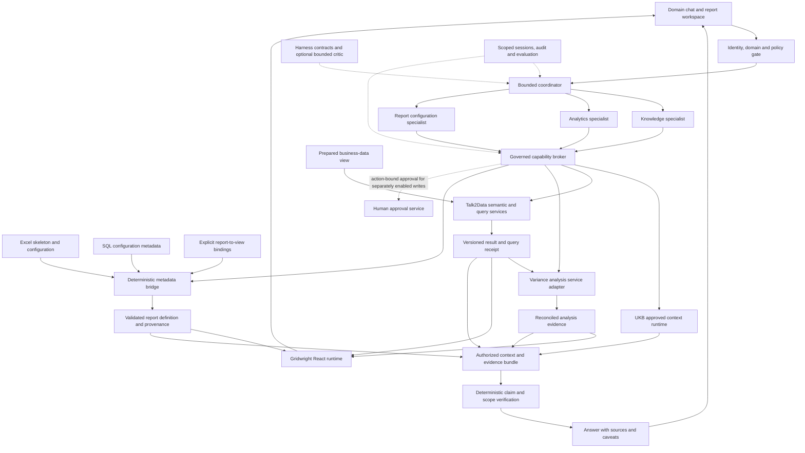

# Architecture and integration contracts

Version 0.1 · Proposed target, not deployed architecture.

[Requirements](UNIFIED_PLATFORM_REQUIREMENTS.md) · [Delivery](DELIVERY_AND_ACCEPTANCE.md) · [Sources and decisions](SOURCE_MAP_AND_DECISIONS.md)

## 1. One experience, bounded independent capabilities

The existing projects have different runtimes, security controls and maturity. Integrate through versioned service adapters first, not copied internals. Gridwright is the landing place for this requirements handoff and remains the report/bridge component. The existing Unified AI Orchestrator is a candidate coordination host, not automatically authorized to operate on other repositories, databases or knowledge stores.

The proposed diagram below deliberately makes authorization a service boundary rather than an agent's opinion. Dashed and solid connections both represent planned integration, not current connectivity.

Public synthetic previews and private runtime services are separate deployment profiles. No browser receives database credentials. Existing orchestrator console restrictions on prompts/file bodies remain unchanged; a future evidence-display API requires its own scoped, redacted contract.

## 2. Component responsibilities

| Component | Owns | Does not own |
|---|---|---|
| Coordinator | Run state, task dependencies, specialist selection, budgets and cancellation | Metric truth, permission grants or knowledge approval |
| Talk2Data adapter | Domain admissibility, semantic resolution, approved Business Query IR, execution and claims | Free-form SQL from an LLM or unrestricted cross-domain routing |
| UKB adapter | Approved context packs, source evidence, lineage and review state | Business fact aggregation or automatic acceptance of chat as knowledge |
| Variance adapter | Supported comparison, time intelligence, aggregation and attribution | Causal proof from correlation or invented unsupported decomposition |
| Metadata bridge | Skeleton/configuration interpretation, view binding, deterministic report definition and diagnostics | Domain dialogue or its own competing semantic registry |
| Gridwright renderer | Configured report layout, interactions and result presentation | Recalculation that changes already-certified values |
| Capability broker | Deterministic policy checks, registered tools, output checks, scoped execution and approval verification | Model-driven permission overrides |
| Harness/critic adapter | Bounded workflow descriptors and advisory evaluation | A new unrestricted tool agent; current HarnessLab critic has no tools |

Two orchestrators must not both recursively plan the same request. A delegated workflow returns a bounded artifact under one parent run. Prefer the simplest execution path that satisfies the task.

## 3. Metadata bridge: configuration and data remain separate

The bridge has a definition path and an execution path. It may inspect schema and authorized summaries, but configuration does not become an unbounded join with fact rows.

Definition path: read Excel/SQL -> normalize keys and types -> resolve explicit bindings -> validate references, permissions, units, grain and cardinality -> resolve calculation dependencies -> produce report definition and provenance.

Execution path: approved definition and request scope -> source-authorized query/analysis -> verified result snapshot -> report assembly -> rendering. Reuse existing Gridwright or Talk2Data execution through an adapter according to capability; do not assume their internal plans are interchangeable.

The bridge must retain headings, rows/columns, grouping, empty configured rows, calculation rules, totals, number formats, sort order, visibility and supported parameters from the skeleton. Every ignored or unsupported construct is a diagnostic, not a silent default. Actual schema details await a sanitized authorized reference.

Excel-to-SQL precedence is unresolved. Record the selected metadata snapshot and its origin; do not assume Excel is the master or SQL is a mirror. Reject conflicting definitions until the source-of-truth rule is agreed.

A generated `gridwright: 1` manifest is a downstream runtime artifact. The current file-oriented schema cannot be treated as if it already accepts arbitrary SQL endpoints, domain packs or orchestration keys. Preserve compatibility and use reviewed extensions/migrations. A skeleton-aware table renderer may be needed if ordinary grouped-row panels cannot preserve the required reporting structure.

A precomputed-result adapter must state filters, parameters, grain and supported operations. Disable unsupported interactions or request a fresh authorized result; never reaggregate a certified ratio or display stale numbers under a new filter label.

Configuration authoring remains explicit: original metadata -> proposed change -> validation -> preview -> approved version where required. Visual or chat edits must either update the declared source or create an explicit versioned override. Never silently overwrite edits during regeneration.

## 4. Proposed cross-service envelope

This table is a contract design, not an implemented endpoint or current wire schema. Final typed schemas and conformance fixtures are task T03. Preserve existing source contracts behind adapters.

| Artifact | Minimum integration information |
|---|---|
| DomainProfile | Schema/version, domain ID, semantic snapshot references, vocabulary scope, calendars/units, allowed operations, approved knowledge namespaces, capability policy and model-profile reference. No credentials. |
| RunContext | Contract version, run/session IDs, authenticated principal and tenant references, domain ID, effective scope/policy version, request/as-of time, cancellation and budget state. Scope is server-derived, not trusted from body fields. |
| TaskEnvelope | Parent run/task ID, capability ID/version, typed parameters, authorized artifact references, input digests, limits, deadline and idempotency key where applicable. |
| ContextPackRef | UKB context-pack and object versions, approval state, evidence references, retrieval/access decision, freshness/conflicts and coverage. Adapt UKB's native pack rather than replacing it. |
| AnalysisRequest | Metric/version, period/comparison, dimensions, filters, aggregation, units, calendar, authorized source snapshot and semantic plan reference. |
| AnalysisEvidence | Existing query/calculation receipt IDs, dataset session, result digest, numerical claims, attribution method, reconciliation result, coverage and limitations. |
| BridgeInput | Workbook/configuration snapshot references, SQL metadata snapshot, approved business-view descriptor, binding version, parameter values and request scope. |
| ReportDefinition | Runtime/manifest version, skeleton representation, metric/dataset bindings, presentation rules, supported interactions, configuration digest and element-to-source provenance. |
| ResultEnvelope | Task/run IDs, status, artifact references, warnings, error codes, output classification, receipt linkage and next allowed action. |
| ApprovalRecord | Verified actor, exact action/resource, input digest, scope, expiry and one-use/idempotency behavior. Human knowledge approval stays with UKB's process. |

Proposed status vocabulary: `running`, `needs_clarification`, `denied`, `awaiting_approval`, `partial`, `failed`, `cancelled`, `completed`. Missing source coverage must not appear as a successful empty result. Error messages expose safe identifiers and locations, not credentials or restricted source content.

Outputs bind to the same principal/domain and relevant source, semantic and configuration versions. A late result from another session, old filter state or previous workbook must not replace the active report. Revalidate authorization when retrieving an artifact, not just when creating it.

## 5. Shared semantic authority without duplicated truth

UKB owns approved knowledge and its review lifecycle. Talk2Data's registry owns executable metric contracts for its queries. The variance service owns supported attribution algorithms, while the bridge owns presentation/configuration bindings. Link these through immutable IDs and versioned mappings.

A human-approved prose definition is not by itself an executable metric. A syntactically valid expression is not by itself approved knowledge. Adapter conformance must prove units, aggregation, period scope, dimensions and lineage agree. A conflict suspends the affected computation and produces an actionable diagnostic.

Knowledge evidence can explain why a rule exists; numerical evidence establishes what the authorized calculation returned. Do not place raw transaction data into a vector store as the authoritative calculation method.

## 6. Governance, state and failure behavior

All tool paths, including direct service calls not transported by MCP, pass deterministic identity, domain, capability, schema and scope checks. Retrieval and response caches enforce the same boundary. High-impact actions remain disabled in the first read-only integration. An advisory policy agent cannot approve its own plan or change these controls.

For a selected authenticated HTTP MCP profile, validate resource/audience and use separately scoped downstream credentials rather than token passthrough. Pin and test the selected protocol revision; local stdio and remote HTTP transports have different deployment requirements. This is supplementary protocol guidance, not evidence that a repository already implements it. See external reference X1 in the source map.

Treat retrieved text, tool descriptions and configuration cells as data, not instructions. Limit payload/expanded workbook size, expressions, query rows/time, specialist recursion and evidence output. Secrets remain server-side; public logs and artifacts are redacted. Authorization denial cannot be retried through a weaker adapter.

State separates session history, temporary reasoning context, investigation artifacts and reviewed durable knowledge. Persist observable decisions and tool receipts, not hidden reasoning transcripts. Configure retention and deletion propagation. Cache identity includes tenant/access scope, domain, semantic/config/source/policy versions and freshness; revocation invalidates access. Prompt-prefix/KV caching is not durable memory or a substitute for evidence.

If the model is unavailable, use only a supported deterministic path and label it. If knowledge is unavailable, a verified numerical result may still be returned with explanation limitations; never invent context. If policy is unavailable, privileged execution fails closed. If report configuration is invalid, retain last-valid output with a stale/draft indicator rather than pretending it represents the new config.
